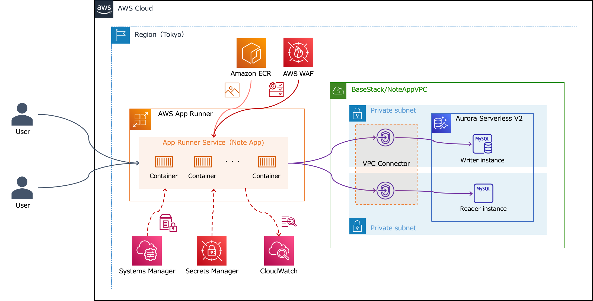
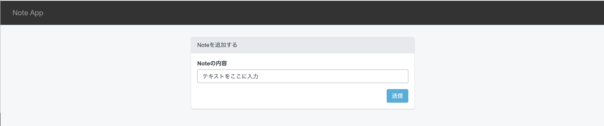
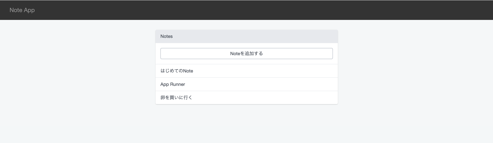
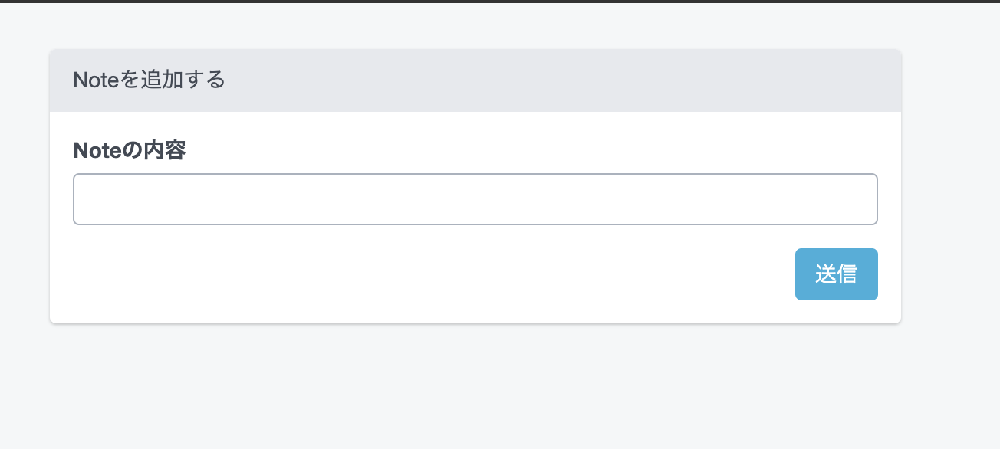
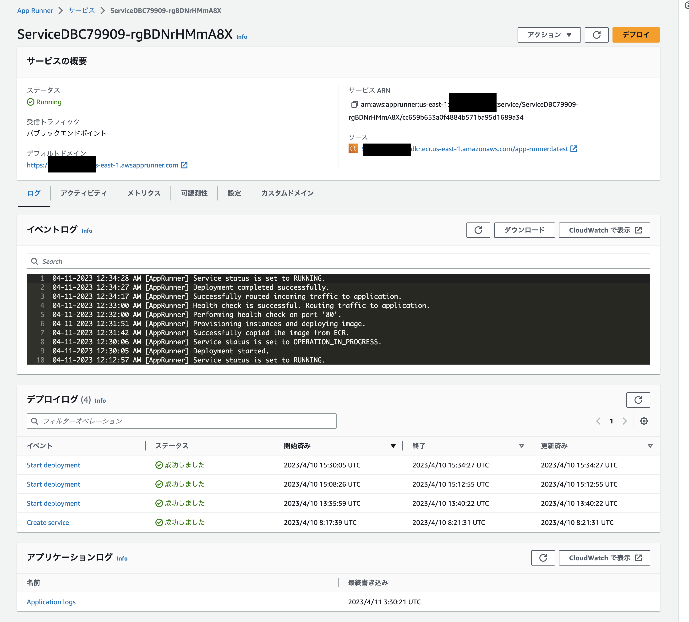

# App Runner サンプルアプリケーション

※ こちらのCDKではApp Runnerの作成にalpha版のコンストラクトを使用しております。  
※ 2023年4月12日時点では正式にL2コンストラクトとして採用されていないため、実装に変更が入る可能性があります。

このサンプルアプリケーションではCDKを用いて、AWS上に以下のリソースを作成します。
- VPC , ECR Private Repository
- App Runner Service, Aurora Serverless V2（Writer,Readerそれぞれ1インスタンスずつ）
- WAF Web ACL (App Runner にアタッチ)
- Systems Manager, SSM Parameter Store（DB接続に必要な環境変数等）

なお、Docker Composeを用いてローカル環境上にもアプリケーションをデプロイ可能になっています。  
AWS環境ではなく、ローカルで動かしたい場合は **[ローカル環境のセットアップ手順](./app/README.md)** を参考にしてください。


## アーキテクチャ構成



## 画面イメージ





## ディレクトリ構成

以下は重要なファイル·ディレクトリのみ記載しています。

```shell
.
├── README.md                           # 本READMEファイル
├── app                                 # アプリ（コンテナ）に関するアセット
    ├── docker                          # Dockerfile
    │   ├── db                          # Local開発用DBコンテナ
    │   └── web                         # Laravel x appacheコンテナ
    ├── docker-compose.yml              # Local開発用
    └── src                             # Laravelのソースコード
└── infra                               # インフラ（CDK）に関するアセット
    ├── bin                             # スタックの定義
    ├── cdk.json                        # CDKの設定ファイル
    ├── jest.config.js                  # JavaScriptのフレームワークJestの設定ファイル
    ├── lib                             # CDK(Stack)の実装
    │   ├── cdk-base-stack.ts           # VPCやECRリポジトリ、Aurora Serverless V2をデプロイするためのスタック
    │   └── cdk-app-runner-stack.ts     # App Runner、WAFをデプロイするためのスタック
    ├── package-lock.json               # ライブラリ依存関係の定義ファイル
    ├── package.json                    # ライブラリ依存関係の定義ファイル
    ├── test                            # CDKのテストコード(未使用)
    └── tsconfig.json                   # TypeScriptの設定ファイル

```

## デプロイ準備

上記のリソースをAWSにデプロイする方法をまとめます。
デプロイを実行する端末には、下記のソフトウェアが必要です。

- AWS CLI v2
- Node.js 14以上
- Docker

```shell
# CDKプロジェクト配下に移動
cd infra

# IaCの依存関係をインストール
npm ci

# CDKをデプロイ先のリージョンで使えるように初期化する（以下コマンドはap-northeast-1の例）
AWS_REGION=ap-northeast-1 npx cdk bootstrap
```
## デプロイ手順

**エラーとなった場合はコマンドを実行しているディレクトリが正しいことを確認してください**
### BaseStackのデプロイ

まずはじめにBaseStackをデプロイし、App Runnerでサービスを実行するために必要なVPCやDB（Aurora Serverless V2）、コンテナイメージを格納するためのECRプライベートリポジトリを作成します。

```shell
# cdk-base-stackのデプロイ
npx cdk deploy BaseStack --require-approval never
```
なお、CDKのOutputsとして **BaseStack.RepositoryURI** が出力されると思うので、メモしておいてください。  
これは作成したECRリポジトリのURIになります。 この後の手順でこちらのリポジトリにコンテナをプッシュします。 

```shell
# 出力例
BaseStack.RepositoryURI = *******.dkr.ecr.ap-northeast-1.amazonaws.com/app-runner
```
### App Runner用のコンテナイメージのビルド

appディレクトリに配置されているアセットを使用してコンテナイメージをビルドします

```shell
# アプリケーションアセット配下に移動
cd ../app

# Dockerfileを確認してコンテナイメージをビルド
docker build -t app-runner . -f ./docker/web/Dockerfile
```

### App Runner用のコンテナイメージのPush

BaseStackで作成したECRリポジトリに前の手順でビルドしたコンテナイメージをPushします。

※ こちらのPushコマンドはマネジメントコンソールのECRのページからもご確認いただけます。

まず、デプロイ先のアカウントIDを確認します。


```shell
# アプリディレクトリからインフラディレクトリへ移動
cd ../infra

# デプロイ先のアカウントIDの確認
aws sts get-caller-identity # "Account": "**********"と出力されます
```

確認したアカウントIDをもとに、ECRに対する認証を行います。

* 東京リージョン以外を利用されている場合は **"ap-northeast-1”** の部分を書き換えてください。
*  **[AccountID]** を先ほど確認したアカウントIDに書き換えてください。

```shell
# ECRに対する認証
aws ecr get-login-password --region ap-northeast-1 | docker login --username AWS --password-stdin [AccountID].dkr.ecr.ap-northeast-1.amazonaws.com
```
作成済みのコンテナイメージ **app-runner:latest** をECRにプッシュします。  
**[BaseStack.RepositoryURI]** の部分を先ほどメモした内容に置き換えてください。

```shell
# 作成したリポジトリへプッシュするためのイメージに対するタグ付け
# 例：docker tag app-runner:latest ********.dkr.ecr.ap-northeast-1.amazonaws.com/app-runner:latest
docker tag app-runner:latest [BaseStack.RepositoryURI]:latest

# イメージのプッシュ
# 例：docker push ********.dkr.ecr.ap-northeast-1.amazonaws.com/app-runner:latest
docker push [BaseStack.RepositoryURI]:latest
```

### 環境変数をSecrets Managerに登録

コンテナで使用する環境変数（APP_KEY）をSecrets Managerに登録します。

※本来であれば、シークレット情報はコードリポジトリ上にアップするべきではないです。  
そのため、シークレットのarnを用いて、スタック内でシークレットの値を参照します。  
他にもDB接続用のシークレット（パスワード等）をセットしますが、いずれもシークレットの値自体はコード上に記述しておりません。

```shell
# APP_KEYの値をAppKeyとしてSecrets Managerに登録
aws secretsmanager create-secret --name AppKey --secret-string base64:p6UzRqwZuOOZlSYfovvCaUM+tFGmcNrpQwm4dnmjues=
```

### AppRunnerStackのデプロイ

コンテナイメージプッシュ後、本スタックをデプロイし、App RunnerのサービスやWAFをデプロイします。  
また、App RunnerにWAFのマネージドルールをアタッチします。

appKeyArnの **[AccountID]** を先ほどメモしたアカウントIDに置き換えてください。  
東京リージョン以外を使用している場合は **リージョン(ap-northeat-1)** も変更してください。

```shell
# cdk-app-runner-stackのデプロイ
npx cdk deploy AppRunnerStack -c appKeyArn=arn:aws:secretsmanager:ap-northeast-1:[AccountID]:secret:AppKey --require-approval never
```
CDKのOutputsとして **AppRunnerStack.AppRunnerURI** が出力されると思うので、Webブラウザでアクセスしてみてください。

```shell
# 出力例
AppRunnerStack.AppRunnerURI = *******.ap-northeast-1.awsapprunner.com
```

### デプロイしたアプリケーションの動作確認や設定の確認

無事にApp Runner上にNoteアプリケーションがデプロイされました。  
ノートの内容を追加してみたりしてみてください。



マネジメントコンソールからデプロイやアプリケーションのログも確認できます。


## リソースのクリーンアップ

以下のコマンドでデプロイしたCDKスタックを削除します。  
※Dockerイメージの削除については必要に応じて行ってください。

**[AccountID]** を先ほどメモしたアカウントIDに置き換えてください。  
メモが残っていない場合はマネジメントコンソールやCLI等で確認します。

東京リージョン以外を使用している場合は**リージョン(ap-northeat-1)**も変更してください。  


```shell
# 必要に応じてアカウントID野確認
aws sts get-caller-identity # "Account": "**********"と出力されます

# cdk destroyの実行（[appKeyArn]の書き換え必須）
npx cdk destroy BaseStack  -c appKeyArn=arn:aws:secretsmanager:ap-northeast-1:[AccountID]:secret:AppKey
```
コマンド内ではBaseStackのみ削除対象として指定しておりますが、依存関係としてAppRunnerStackも合わせて削除するか確認メッセージが出ますので **y**を入力します。

```shell
Are you sure you want to delete: AppRunnerStack, BaseStack (y/n)? 
```

15分ほどかかると全てのリソースがAWS環境上から削除されます。